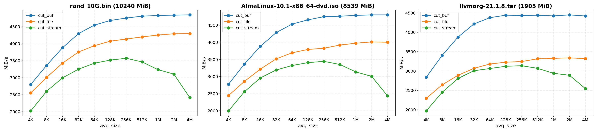

# PyFastCDC

A FastCDC 2020 implementation written in Python, with [Cython](https://github.com/cython/cython) acceleration

Supports Python 3.6+

**Still under development**

## Installation

TODO

PyFastCDC is available on PyPI with prebuilt wheels for common platforms. You can install it via pip or other Python package managers you want:

```bash
pip install pyfastcdc
```

For platforms without prebuilt wheels, a suitable build environment capable of compiling Python extension modules is required.
For example, you might need to install `gcc` and `python3-dev` via `apt` in Debian

If the Cython extension fails to compile, the installation will fall back
to a pure-Python implementation, which is significantly slower

## Usage

TODO

```python
import hashlib
from pyfastcdc import FastCDC

for chunk in FastCDC(16384).cut_file('archive.tar'):
	print(chunk.offset, chunk.length, hashlib.sha256(chunk.data).hexdigest())
```

Please only import members from `pyfastcdc` in your application code and avoid importing inner modules (e.g. `pyfastcdc.common`) directly.
Only public APIs inside the `pyfastcdc` module are guaranteed to be stable across releases

```python
from pyfastcdc import Chunk         # GOOD
from pyfastcdc.common import Chunk  # BAD, no API stability guarantee
```

## Performance

With the help of Cython, PyFastCDC can achieve near-native performance on chunking inputs



Each test was run 10 times for averaging, achieving a maximum in-memory chunking speed of about 4.8GB/s

FastCDC parameters:

- `avg_size`: Independent variable
- `min_size`: `avg_size` / 4 (default)
- `max_size`: `avg_size` * 4 (default)
- `normalized_chunking`: 1 (default)
- `seed`: 1 (default)

Test environment:

- Python 3.11.14, Cython 3.2.4
- Ryzen 7 6800H @ 4.55GHz, NVMe SSD, Debian 13.2

Test files:

- `rand_10G.bin`: 10GiB randomly generated binary data
- [`AlmaLinux-10.1-x86_64-dvd.iso`](https://repo.almalinux.org/almalinux/10/isos/x86_64/AlmaLinux-10.1-x86_64-dvd.iso): the DVD ISO image of AlmaLinux 10.1
- [`llvmorg-21.1.8.tar`](https://github.com/llvm/llvm-project/archive/refs/tags/llvmorg-21.1.8.tar.gz): gzip-unzipped LLVM 21.1.8 source code

Test command:

```bash
cd scripts
python benchmark.py --test-files rand_10G.bin AlmaLinux-10.1-x86_64-dvd.iso llvmorg-21.1.8.tar
```

## Difference from iscc/fastcdc-py

This project is inspired by [iscc/fastcdc-py](https://github.com/iscc/fastcdc-py), but differs in the following ways:

1. Based on nlfiedler/fastcdc-rs, using its FastCDC 2020 implementation aligned with the original paper, rather than the simplified ronomon implementation
2. Supports multiple types of input, including in-memory data buffers, regular file using mmap, and custom streaming input
3. Does not include any CLI tool. It provides only the core FastCDC functionality

## License

[MIT](LICENSE)

## Reference

Papers

- FastCDC 2016: [FastCDC: A Fast and Efficient Content-Defined Chunking Approach for Data Deduplication](https://www.usenix.org/system/files/conference/atc16/atc16-paper-xia.pdf)
- FastCDC 2020: [The Design of Fast Content-Defined Chunking for Data Deduplication Based Storage Systems](https://ieeexplore.ieee.org/document/9055082)

Other FastCDC Implementations

- [nlfiedler/fastcdc-rs](https://github.com/nlfiedler/fastcdc-rs), where this implementation is based on
- [iscc/fastcdc-py](https://github.com/iscc/fastcdc-py), which provides an alternative FastCDC implementation based on [ronomon/deduplication](https://github.com/ronomon/deduplication)
